# NNF

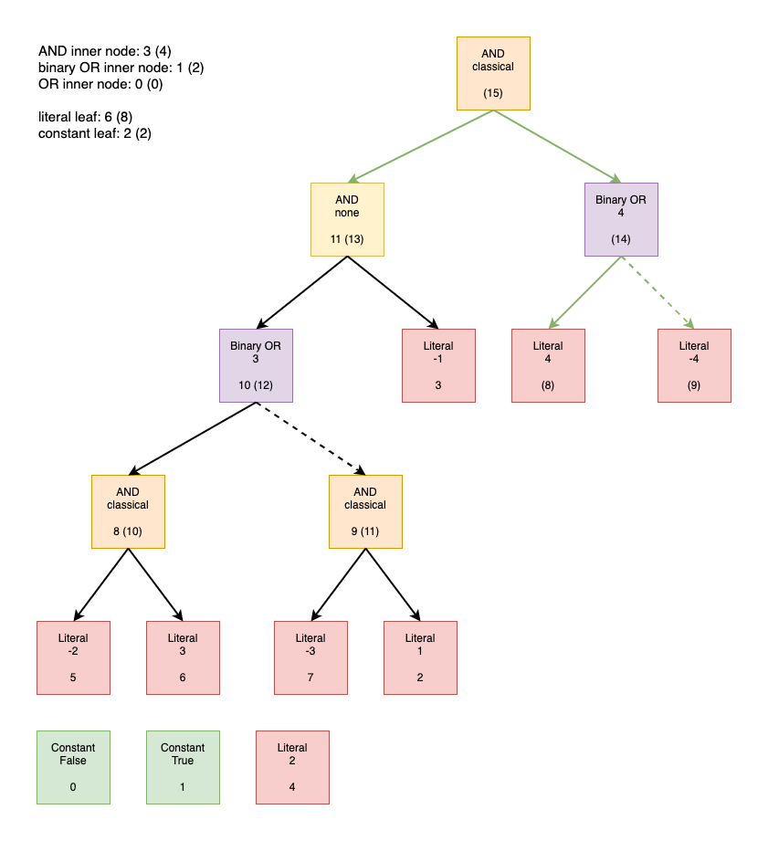

# s-NNF

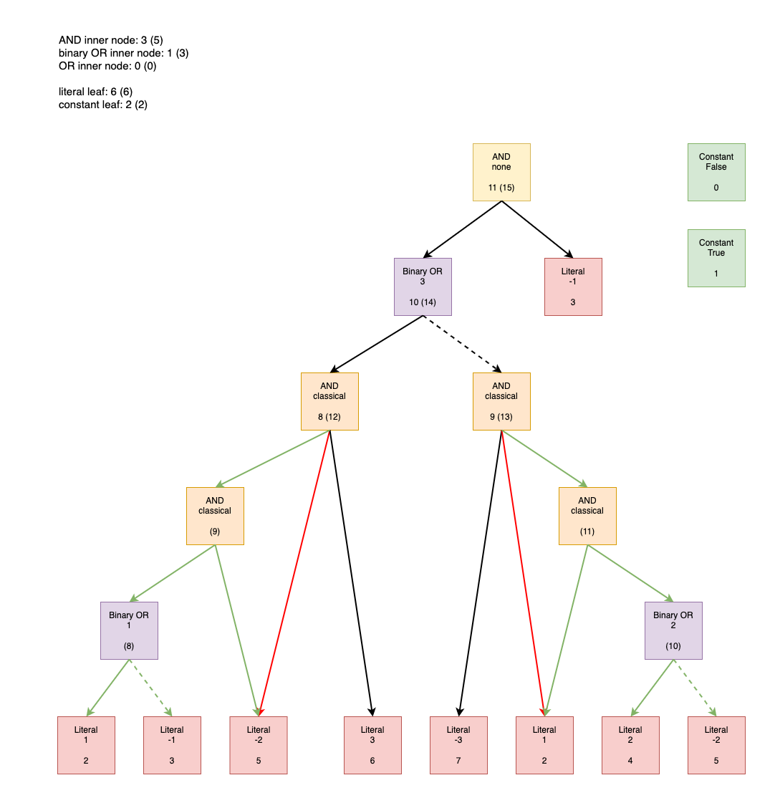

# DNNF

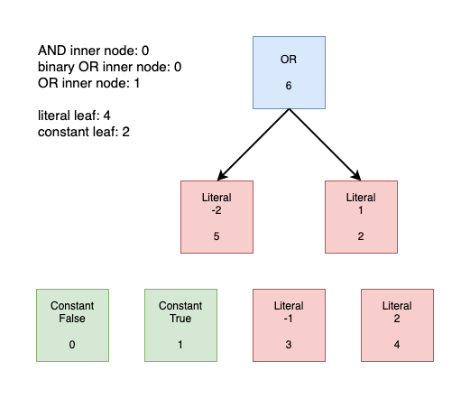

# s-DNNF

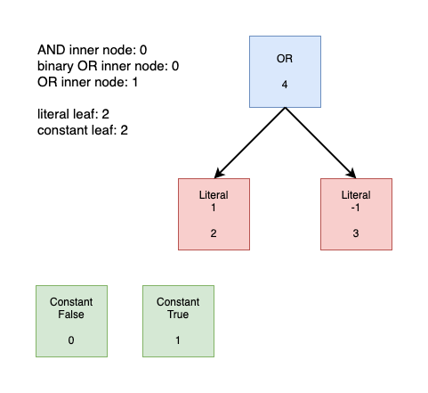

# pwDNNF

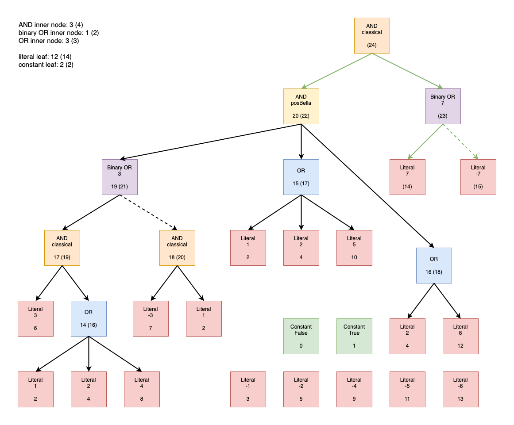

# nwDNNF

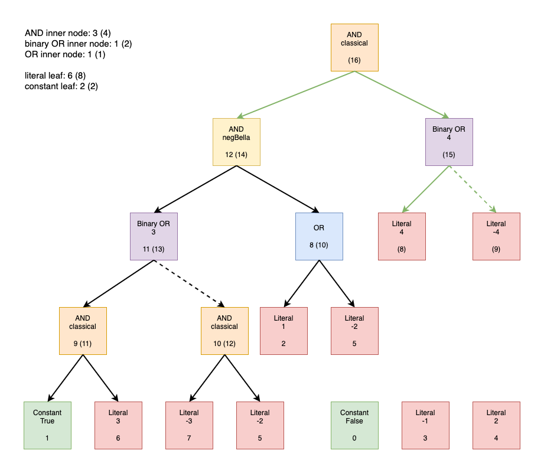

# wDNNF 1

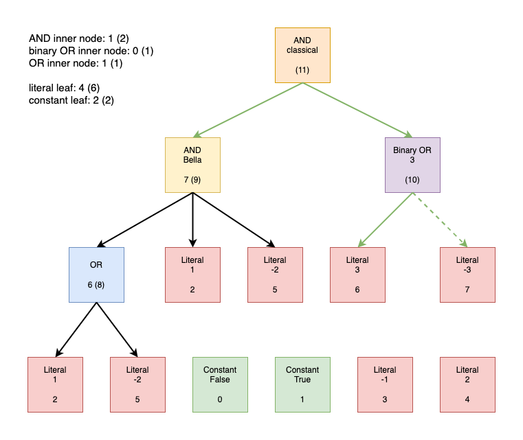

# wDNNF 2

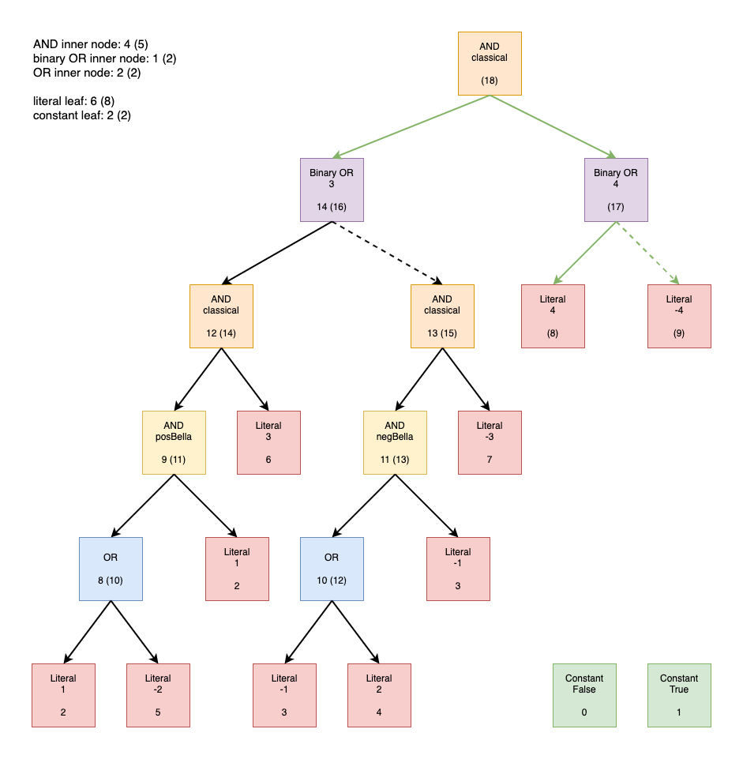

# d-DNNF

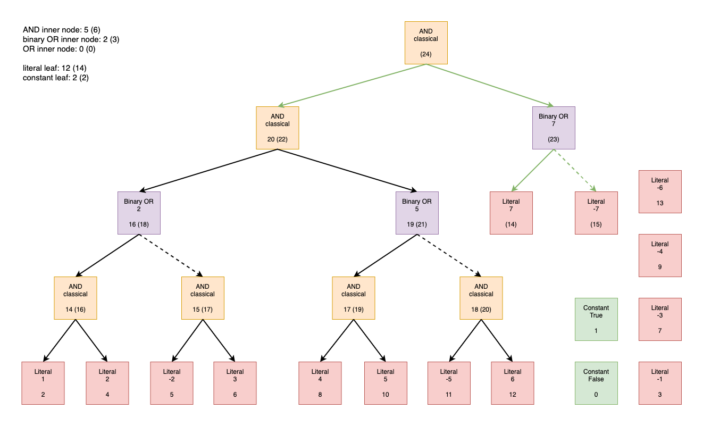

# sd-DNNF

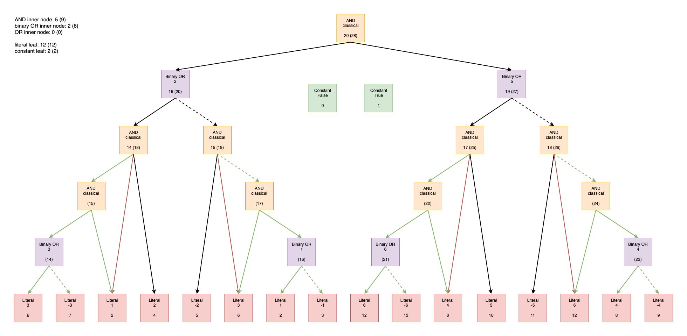

# {Krom-C}-d-BDMC

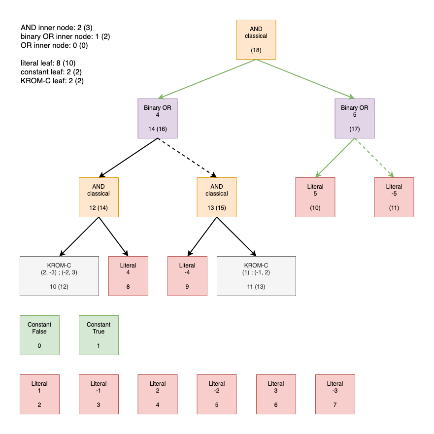

# {Krom-C}-sd-BDMC

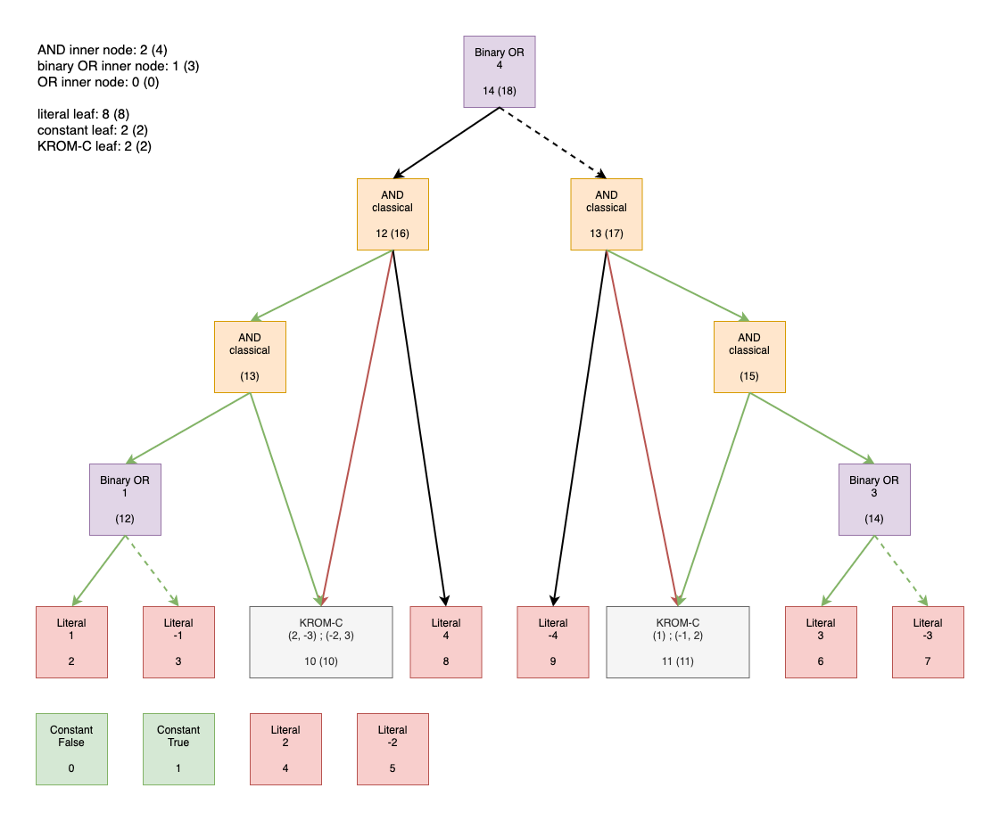

# {renH-C}-d-BDMC

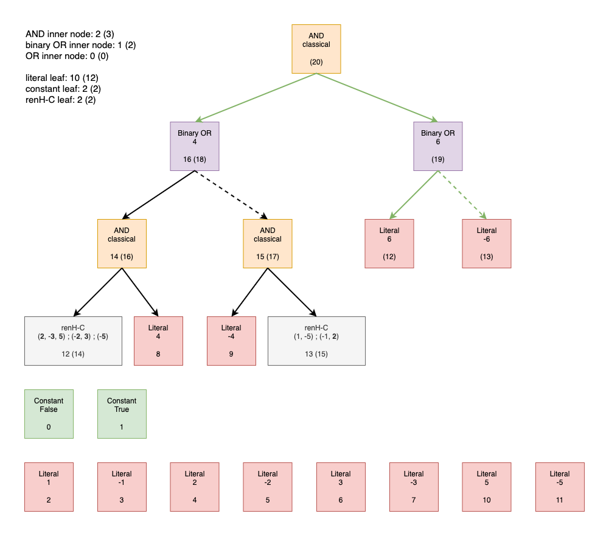

# {renH-C}-sd-BDMC

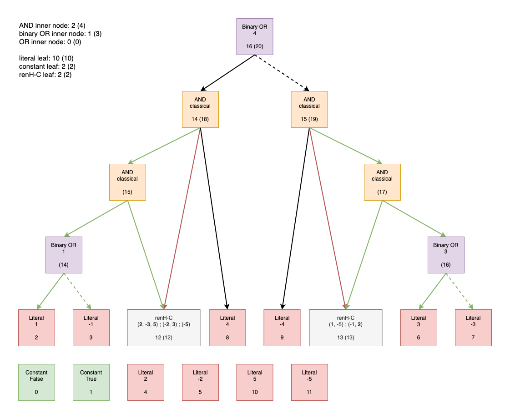
