# Hydra

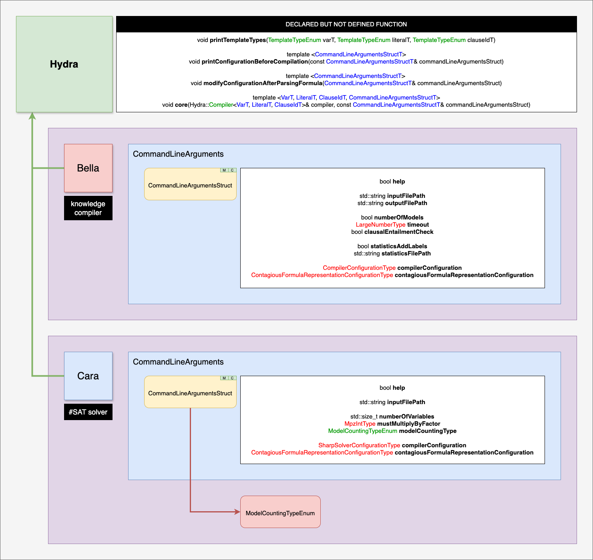

## Compiler

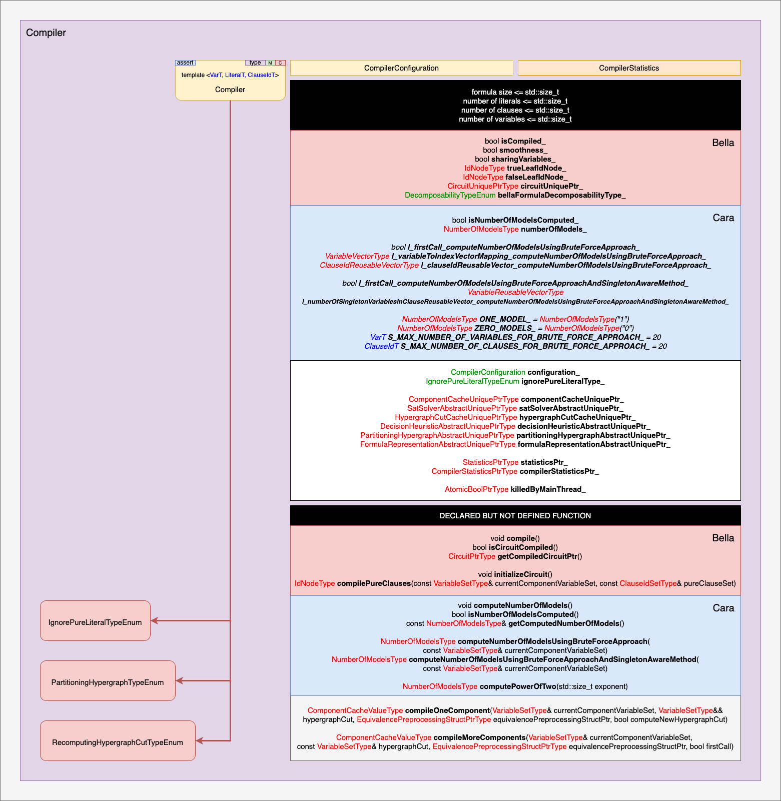

## Circuit

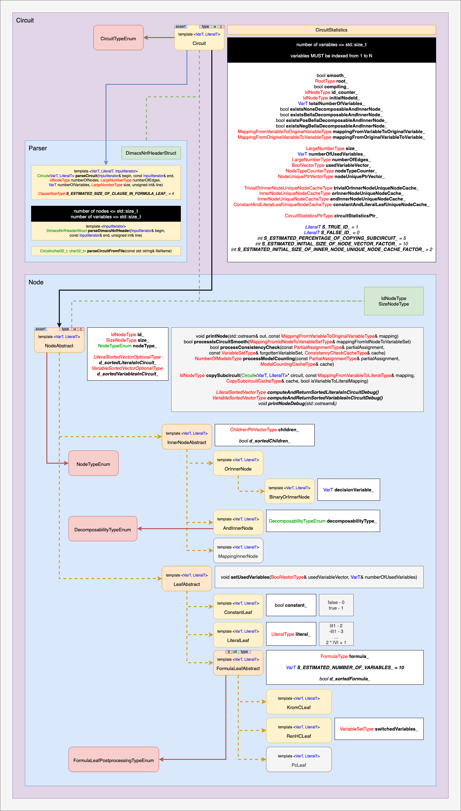

## Container

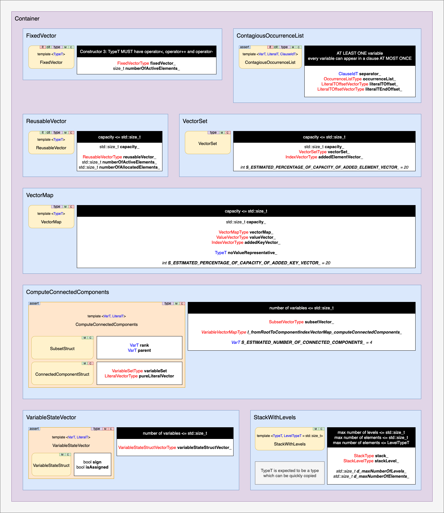

## Type

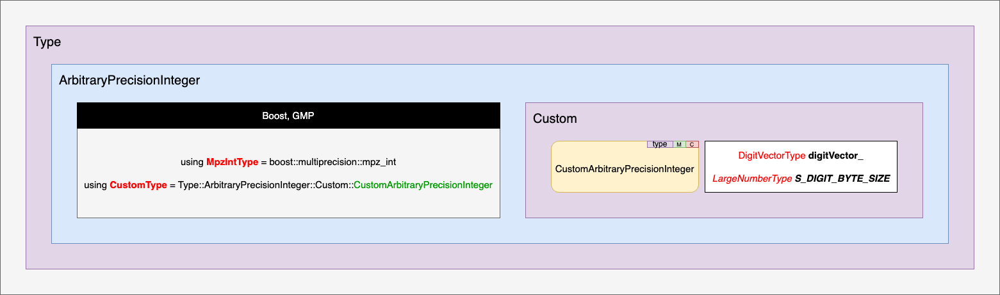

## SAT solver

## Partitioning hypergraph

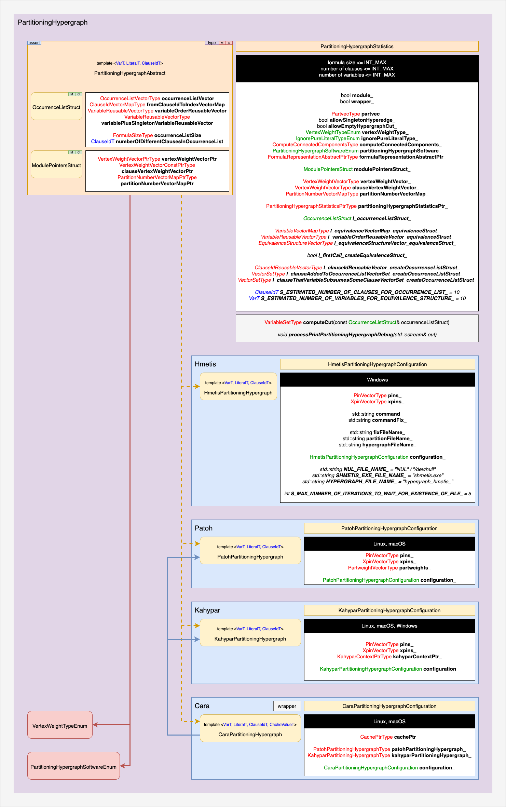

## Decision heuristic

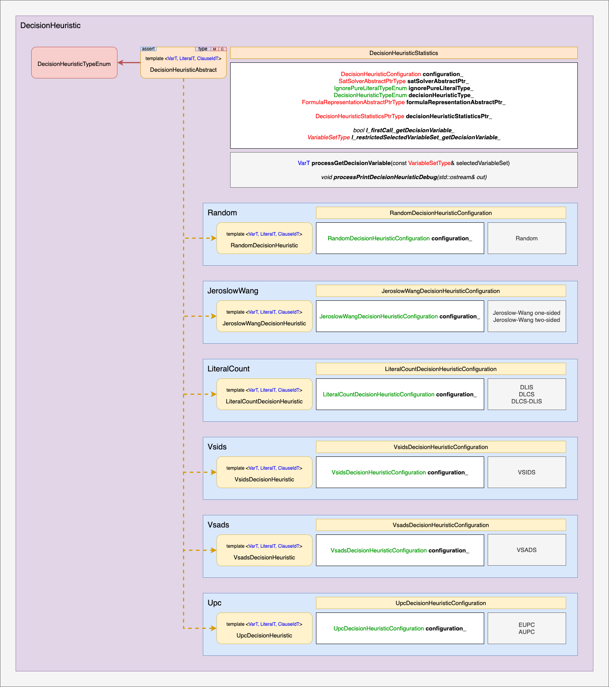

## Cache

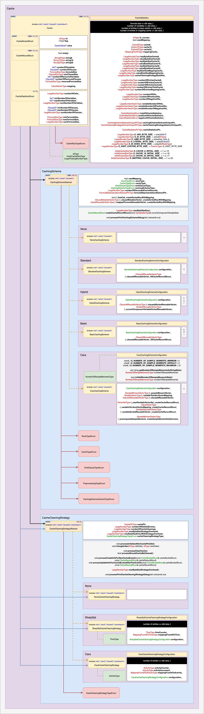

## RenH-C recognition

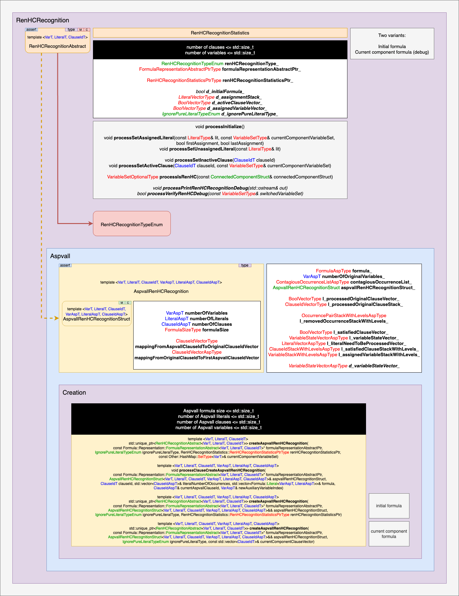

## Statistics

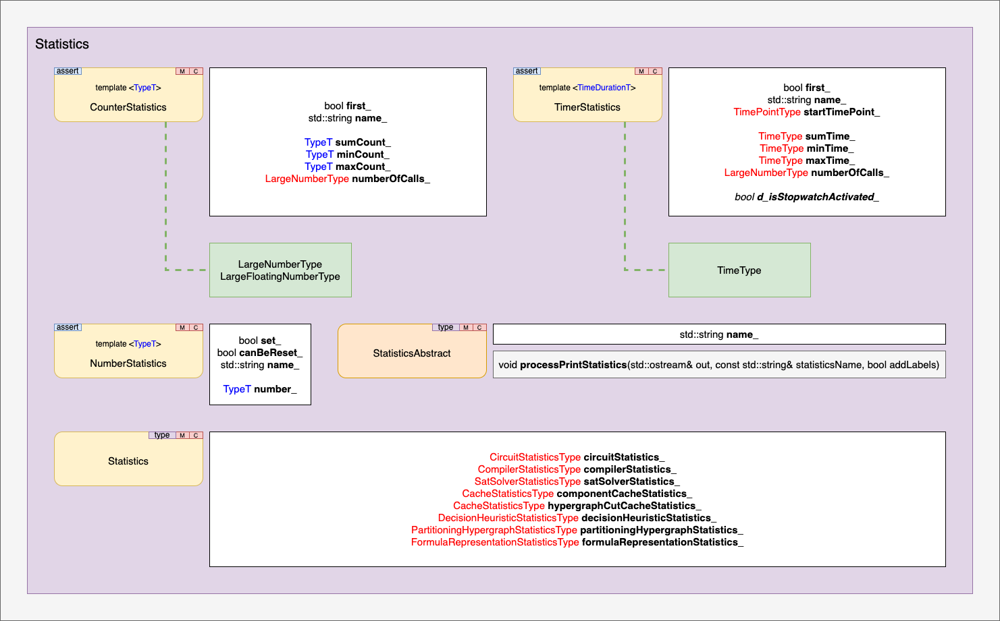

## Formula

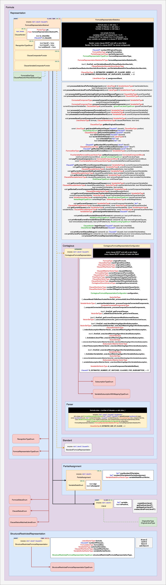

### Formula representation and occurrence list

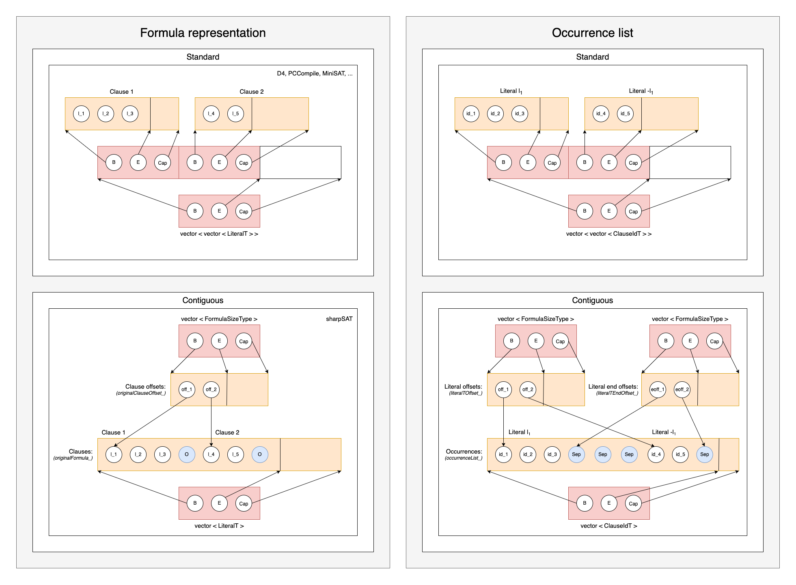
